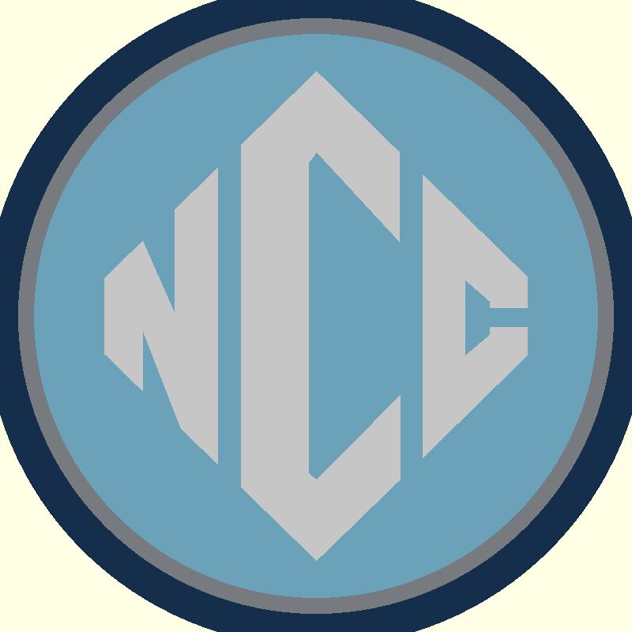
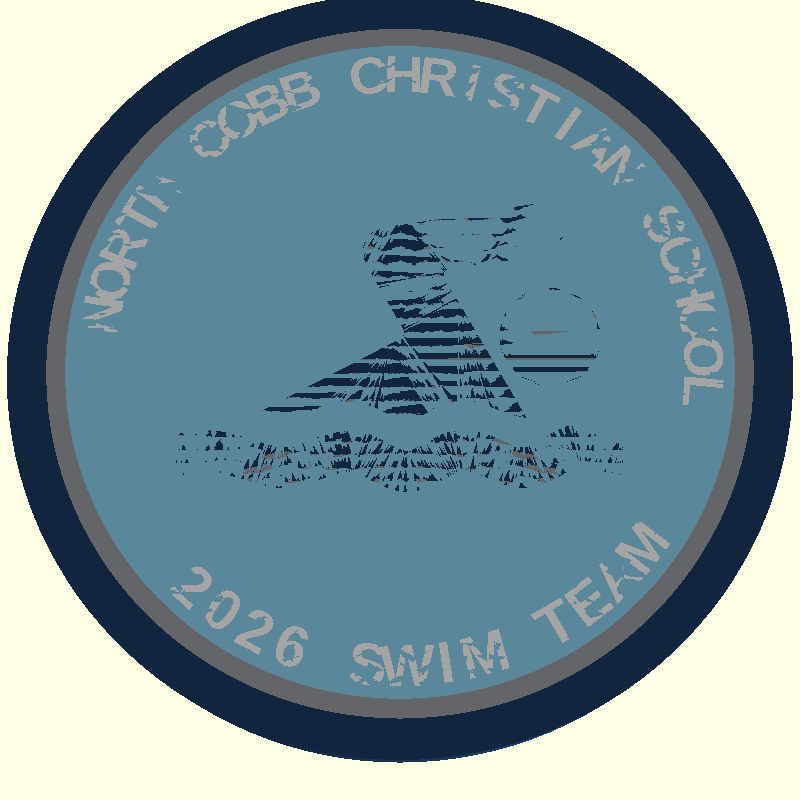
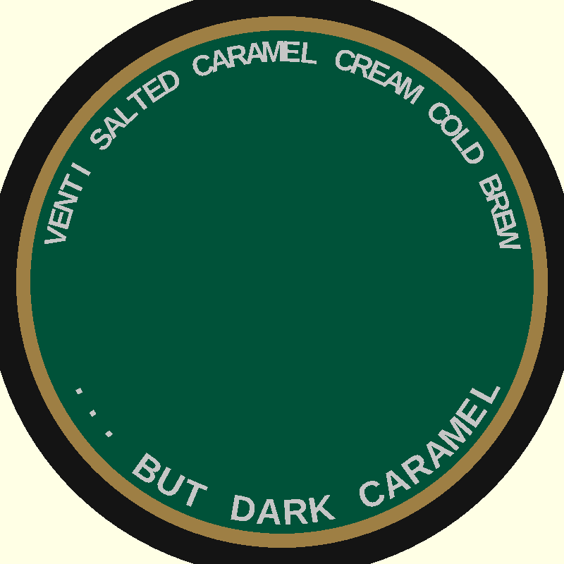
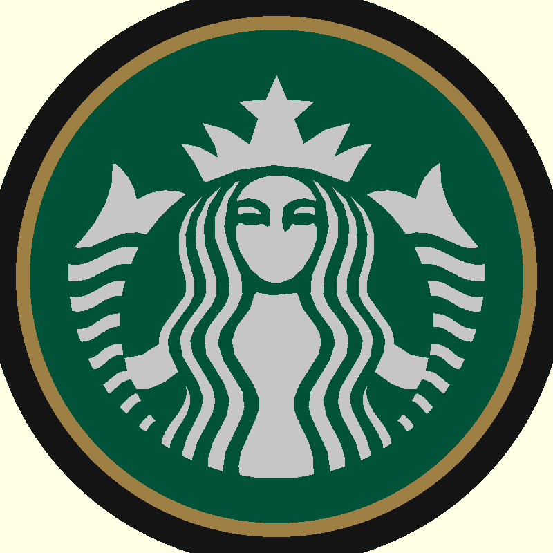

# Challenge Coins

A collection of 3D-printed, multi-color challenge coins for the **Bambu P1S + AMS Pro 2**.
Every coin is double-sided, 50mm diameter, 4-color, single-pass — no assembly, no glue.

---

## NCCS Challenge Coin

**North Cobb Christian School · 2026 Swim Team**

| Obverse (Front) | Reverse (Back) |
|:---:|:---:|
|  |  |

NCC shield logo on front · swimmer silhouette + arc text on back

| Slot | Color              | Used For                                     |
|:----:|--------------------|----------------------------------------------|
|  1   | 🔵 Navy Blue       | Outer rim · diamond body · swimmer           |
|  2   | 🩶 Dark Gray       | Accent ring *(swap for gold to make it pop)* |
|  3   | 🩵 Carolina Blue   | Inner field (both faces)                     |
|  4   | ⚪ White           | NCC letters · arc text                       |

→ [Full details](nccs_challenge_coin/README.md)

---

## Turtles Challenge Coin

**Turtles, Inc. · 5th Grade Business Club · 2025–2026**

| Obverse (Front) | Reverse (Back) |
|:---:|:---:|
|  |  |

Sea turtle silhouette + "TURTLES,INC." arc on front · NCC school logo on back

| Slot | Color    | Used For                                    |
|:----:|----------|---------------------------------------------|
|  1   | ⚫ Black | Outer rim · turtle silhouette · NCC diamond |
|  2   | 🟡 Gold  | Accent ring · NCC border outline            |
|  3   | 🟢 Green | Inner field (base layer)                    |
|  4   | ⚪ White | Arc text · NCC letters                      |

→ [Full details](turtles/README.md)

---

## Darth Vader Challenge Coin

**Inside Joke · Starbucks Edition · 2026**

| Obverse (Front) | Reverse (Back) |
|:---:|:---:|
|  |  |

Vader helmet silhouette + drink order arc text on front · Starbucks siren on back

| Slot | Color              | Used For                                        |
|:----:|--------------------|--------------------------------------------------|
|  1   | ⚫ Black           | Outer rim · Vader helmet silhouette             |
|  2   | 🟡 Starbucks Gold  | Accent ring                                     |
|  3   | 🟢 Starbucks Green | Inner field (base layer)                        |
|  4   | ⚪ White           | Arc text · Starbucks siren (reverse)            |

→ [Full details](darth_vader/README.md)

---

## Specifications

| Parameter     | Value             |
|---------------|-------------------|
| Diameter      | 50 mm             |
| Thickness     | 5.0 mm            |
| Relief height | 0.6 mm            |
| Colors        | 4 (AMS slots 1–4) |
| Supports      | None required     |

---

## Build

**Requirements:** OpenSCAD · Python 3 · `pip install pillow pytest` · Bambu Studio 02.05.00.66+

```bash
cd nccs_challenge_coin/        # or turtles/
./build.sh                     # render STLs + preview PNGs
python3 create_3mf.py          # package Bambu-native 3MF
python3 -m pytest test_3mf.py  # verify (18 tests)
# Open build/*.3mf in Bambu Studio
```

See [CLAUDE.md](CLAUDE.md) for shared design standards.

---

## License

Build tooling (`create_3mf.py`, `test_3mf.py`, `build.sh`) is MIT.
Individual coin designs may differ — see each coin's README.
